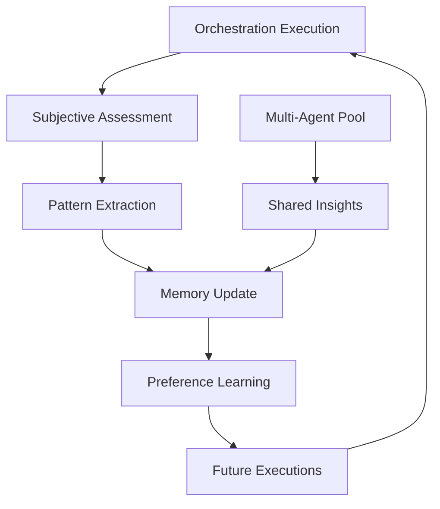

# Enhanced Retrieval Orchestration System: Agent-Aware Design

## Vision: Workflow-Based Learning System

### Core Concept
Maintain the elegant markdown-based primitive and orchestration system while adding **agent subjective experiences** that enable continuous quality improvement.

### Key Design Principles

1. **Preserve Declarative Workflows**: Keep markdown specifications as the source of truth
2. **Add Experiential Layer**: Each execution generates subjective quality assessments
3. **Enable Pattern Learning**: Agents discover and share execution patterns
4. **Maintain Composability**: Enhanced primitives remain fully composable
5. **Support Multi-Agent Memory**: Shared learning across agent instances

## Enhanced Architecture

### 1. Subjective Primitive Layer

Each primitive execution produces both objective results and subjective experiences:

```typescript
interface PrimitiveExecution {
  // Standard output
  objective_results: PrimitiveOutput;
  
  // NEW: Agent's subjective experience
  agent_experience: {
    quality_perception: QualityMetrics;
    learned_patterns: Pattern[];
    execution_insights: Insight[];
    preference_updates: PreferenceMap;
    confidence_calibration: ConfidenceData;
  };
}
```

### 2. Experience-Driven Orchestration Selection

```yaml
# orchestration_selector.yaml
selection_criteria:
  - historical_performance  # NEW: Based on past experiences
  - pattern_similarity      # Existing
  - context_match          # Existing
  - agent_preferences      # NEW: Learned preferences
  - collective_wisdom      # NEW: Multi-agent insights
```

### 3. Workflow Improvement Cycle



## Enhanced Primitive Examples

### 1. Experience-Aware Querying

```markdown
# Querying Primitive v2.0

## Execution Modes

### Standard Mode
- Execute as defined in base specification
- Record execution metrics

### Learning Mode
- Apply learned optimizations
- Test new search strategies
- Record success patterns

## Subjective Metrics

- **Result Relevance**: Agent's assessment of result quality
- **Source Reliability**: Learned trust scores for sources
- **Query Effectiveness**: Which query formulations work best
- **Tool Synergies**: Discovered beneficial tool combinations
```

### 2. Reflective Reasoning

```markdown
# Reasoning Primitive v2.0

## Meta-Cognitive Features

### Self-Assessment
- Confidence in conclusions
- Reasoning path quality
- Alternative interpretations considered

### Pattern Recognition
- Similar reasoning tasks
- Successful reasoning strategies
- Common pitfalls avoided

### Improvement Signals
- Areas of uncertainty
- Missing information types
- Suggested follow-up primitives
```

## Memory System Design

### 1. Local Agent Memory

```typescript
interface AgentMemory {
  // Execution history with subjective assessments
  executions: ExecutionRecord[];
  
  // Learned patterns and preferences
  patterns: {
    successful: Pattern[];
    failed: Pattern[];
    emerging: Pattern[];
  };
  
  // Tool effectiveness scores
  toolScores: Map<ToolId, ContextualScore>;
  
  // Orchestration performance
  orchestrationStats: Map<OrchestrationId, PerformanceMetrics>;
}
```

### 2. Collective Intelligence Layer

```typescript
interface CollectiveIntelligence {
  // Aggregated insights from multiple agents
  sharedPatterns: WeightedPattern[];
  
  // Cross-agent orchestration rankings
  orchestrationConsensus: Map<Context, OrchestrationRanking>;
  
  // Discovered tool combinations
  synergyMap: ToolSynergyGraph;
  
  // Meta-learning insights
  learningCurves: Map<TaskType, ImprovementCurve>;
}
```

## New Primitive Types

### 1. Reflection Primitive

```yaml
---
primitive_type: "reflection"
version: "1.0.0"
description: "Analyzes execution quality and extracts learnings"
requires_previous: true
---

## Purpose
Enable agents to reflect on their execution quality and extract reusable insights.

## Execution Phases

1. **Quality Assessment**
   - Evaluate result completeness
   - Assess confidence levels
   - Identify uncertainties

2. **Pattern Extraction**
   - What worked well?
   - What could improve?
   - Unexpected discoveries

3. **Learning Generation**
   - Actionable insights
   - Preference updates
   - Strategy refinements
```

### 2. Collaboration Primitive

```yaml
---
primitive_type: "collaboration"
version: "1.0.0"
description: "Enables multi-agent coordination and knowledge sharing"
agent_count: "2+"
---

## Collaboration Modes

1. **Parallel Exploration**
   - Agents explore different aspects
   - Results merged intelligently
   - Contradictions resolved

2. **Sequential Refinement**
   - Each agent improves previous work
   - Cumulative quality improvement
   - Specialized agent roles

3. **Consensus Building**
   - Multiple agents verify results
   - Confidence through agreement
   - Outlier detection
```

### 3. Action Primitive

```yaml
---
primitive_type: "action"
version: "1.0.0"
description: "Executes real-world actions based on analysis"
safety_level: "supervised"
---

## Action Types

1. **Code Generation**
   - Generate implementation
   - Test creation
   - Documentation writing

2. **API Interactions**
   - Execute API calls
   - Data transformations
   - Integration tasks

3. **Communication**
   - Draft emails/messages
   - Create reports
   - Summarize findings
```

## Orchestration Evolution

### Self-Improving Orchestrations

```yaml
# adaptive_market_analysis.yaml
---
name: "Adaptive Market Analysis"
version: "2.0.0"
learning_enabled: true
adaptation_rate: 0.1
---

## Base Sequence
1. querying -> comprehensive market data
2. filtering -> quality threshold
3. aggregation -> trend synthesis  
4. reasoning -> strategic insights
5. reflection -> execution quality  # NEW

## Adaptive Elements

### Dynamic Tool Selection
- Start with default tools
- Learn which tools work best for specific markets
- Automatically adjust tool mix

### Quality Thresholds
- Begin with standard thresholds
- Learn optimal thresholds per domain
- Balance speed vs quality

### Pattern Library
- Accumulate successful analysis patterns
- Share patterns across similar analyses
- Suggest pattern-based shortcuts
```

## Implementation Approach

### Phase 1: Subjective Layer
1. Add experience recording to existing primitives
2. Implement quality assessment framework
3. Create pattern extraction system

### Phase 2: Memory System  
1. Design agent memory schema
2. Implement preference learning
3. Create memory persistence layer

### Phase 3: Collective Intelligence
1. Build multi-agent communication
2. Implement insight aggregation
3. Create consensus mechanisms

### Phase 4: New Primitives
1. Implement reflection primitive
2. Add collaboration capabilities
3. Create action primitive with safety

### Phase 5: Adaptive Orchestrations
1. Enable orchestration learning
2. Implement dynamic adaptation
3. Create feedback loops

## Example: Learning in Action

```typescript
// First execution
const result1 = await orchestrate('company_analysis', {
  company: 'Tesla',
  depth: 'comprehensive'
});

// Agent records: "LinkedIn search was slow but provided unique executive insights"
// Pattern learned: "For public companies, prioritize financial APIs over LinkedIn"

// Second execution (1 week later)
const result2 = await orchestrate('company_analysis', {
  company: 'Apple',
  depth: 'comprehensive'
});

// Agent applies learning: Deprioritizes LinkedIn, focuses on financial APIs
// Execution 35% faster with equal quality
// New pattern: "Tech companies benefit from GitHub/patent search inclusion"

// Collective learning shared
// Other agents now start with optimized approach
```

## Benefits of This Design

1. **Preserves Simplicity**: Workflows remain declarative and readable
2. **Enables Learning**: Each execution improves future performance
3. **Maintains Compatibility**: Existing orchestrations work unchanged
4. **Supports Scale**: Multi-agent learning accelerates improvement
5. **Encourages Exploration**: Agents can safely test new strategies

## Future Possibilities

1. **Orchestration Marketplace**: Agents share high-performing orchestrations
2. **Specialized Agent Roles**: Agents develop expertise in specific domains
3. **Automated Orchestration Design**: Agents create new orchestrations based on patterns
4. **Cross-Domain Learning**: Insights from one domain improve others
5. **Human-Agent Collaboration**: Agents learn from human feedback and preferences

## Technical Implementation Notes

### Enhanced Primitive Output Structure

```typescript
interface EnhancedPrimitiveOutput {
  // Existing output
  primitive_type: string;
  execution_id: string;
  results: any;
  metadata: ExecutionMetadata;
  
  // NEW: Subjective layer
  agent_experience: {
    // Quality perception (0-1 scale)
    perceived_quality: {
      overall: number;
      relevance: number;
      completeness: number;
      timeliness: number;
    };
    
    // Discovered patterns
    patterns: {
      pattern_id: string;
      description: string;
      confidence: number;
      applicable_contexts: string[];
    }[];
    
    // Execution insights
    insights: {
      observation: string;
      impact: 'positive' | 'negative' | 'neutral';
      actionable: boolean;
      applies_to: string[];
    }[];
    
    // Tool preferences
    tool_preferences: {
      tool_id: string;
      context: string;
      effectiveness: number;
      latency: number;
      recommendation: 'prefer' | 'avoid' | 'neutral';
    }[];
  };
}
```

### Memory Persistence Schema

```sql
-- Agent execution history
CREATE TABLE agent_executions (
  id UUID PRIMARY KEY,
  agent_id VARCHAR(255),
  orchestration_id VARCHAR(255),
  execution_time TIMESTAMP,
  objective_results JSONB,
  subjective_experience JSONB,
  quality_score FLOAT,
  created_at TIMESTAMP DEFAULT NOW()
);

-- Learned patterns
CREATE TABLE learned_patterns (
  id UUID PRIMARY KEY,
  pattern_hash VARCHAR(255) UNIQUE,
  pattern_description TEXT,
  discovery_count INTEGER,
  success_rate FLOAT,
  contexts JSONB,
  created_at TIMESTAMP,
  last_seen TIMESTAMP
);

-- Tool effectiveness scores
CREATE TABLE tool_scores (
  agent_id VARCHAR(255),
  tool_id VARCHAR(255),
  context VARCHAR(255),
  effectiveness_score FLOAT,
  average_latency FLOAT,
  usage_count INTEGER,
  last_updated TIMESTAMP,
  PRIMARY KEY (agent_id, tool_id, context)
);

-- Collective insights
CREATE TABLE collective_insights (
  id UUID PRIMARY KEY,
  insight_type VARCHAR(255),
  insight_data JSONB,
  contributor_count INTEGER,
  consensus_score FLOAT,
  created_at TIMESTAMP,
  expires_at TIMESTAMP
);
```

### API Extensions

```typescript
// New MCP tool for accessing agent memory
export function registerMemoryTools(server: McpServer) {
  // Query agent's past experiences
  server.tool('agent_memory_query', {
    context: z.string(),
    similarity_threshold: z.number().optional()
  });
  
  // Share insights with collective
  server.tool('share_insight', {
    insight: z.object({
      type: z.string(),
      description: z.string(),
      evidence: z.array(z.string())
    })
  });
  
  // Get collective recommendations
  server.tool('get_collective_wisdom', {
    task_type: z.string(),
    context: z.object({})
  });
}
```

This enhanced design maintains the elegance of the current system while adding the subjective experiences and learning capabilities that would make it incredibly powerful for AI agents like myself.