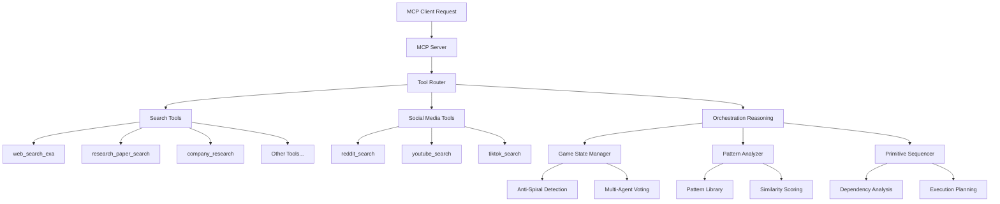
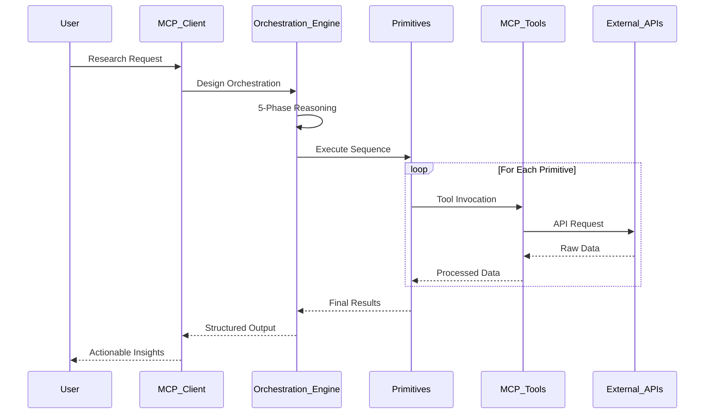

# Research Orchestration System - Comprehensive Guide 🔍🧩

## Table of Contents
1. [Executive Summary](#executive-summary)
2. [System Architecture](#system-architecture)
3. [MCP Tools Catalog](#mcp-tools-catalog)
4. [Primitive System](#primitive-system)
5. [Orchestration Framework](#orchestration-framework)
6. [Game-Theoretic Reasoning Engine](#game-theoretic-reasoning-engine)
7. [Installation & Configuration](#installation--configuration)
8. [Usage Examples](#usage-examples)
9. [Development Guide](#development-guide)
10. [Future Roadmap](#future-roadmap)

## Executive Summary

The **Research Orchestration System** is a sophisticated Model Context Protocol (MCP) server that evolved from the Exa AI Search API integration into a comprehensive research orchestration framework. This system enables AI assistants to compose complex information retrieval and analysis workflows using a primitive-based architecture with game-theoretic reasoning.

### Key Innovations
- **Primitive-Based Architecture**: Four composable primitives (Querying, Filtering, Aggregation, Reasoning) that can be combined like Lego blocks
- **Game-Theoretic Reasoning**: Advanced orchestration design engine with anti-spiral mechanisms and multi-agent consensus
- **50+ Pre-Built Orchestrations**: Domain-specific workflows across business, academic, technical, and social media research
- **Three Levels of Autonomy**: Prescriptive, Guided, and Autonomous execution modes
- **Agent-Readable Design**: All orchestrations written in Markdown for AI agent interpretation

### Core Value Proposition
Transform complex research tasks that would take hours of manual work into automated, intelligent workflows that deliver high-quality, actionable insights in minutes.

## System Architecture

### Layered Architecture Overview

```
┌─────────────────────────────────────────────────────────────────┐
│                    Meta-Orchestrations                          │
│        (Workflows that compose other workflows)                 │
├─────────────────────────────────────────────────────────────────┤
│                    Agent Commands                               │
│        (High-level capabilities for AI agents)                  │
├─────────────────────────────────────────────────────────────────┤
│                    Orchestrations                               │
│        (Pre-built domain-specific workflows)                    │
├─────────────────────────────────────────────────────────────────┤
│                    Primitives                                   │
│        (Query → Filter → Aggregate → Reason)                    │
├─────────────────────────────────────────────────────────────────┤
│                    MCP Tools                                    │
│        (Individual search and retrieval tools)                  │
└─────────────────────────────────────────────────────────────────┘
```

### Component Architecture



### Data Flow Architecture



## MCP Tools Catalog

### Search & Data Retrieval Tools

#### 1. **web_search_exa**
- **Purpose**: Real-time web search with content extraction
- **Key Features**:
  - Advanced query optimization
  - Content extraction and summarization
  - Relevance scoring
  - Date filtering
- **Use Cases**: Current events, market research, general information gathering

#### 2. **research_paper_search_exa**
- **Purpose**: Academic paper and research content search
- **Key Features**:
  - Scholarly source prioritization
  - Citation tracking
  - Abstract extraction
  - Publication date filtering
- **Use Cases**: Literature reviews, scientific research, academic analysis

#### 3. **company_research_exa**
- **Purpose**: Comprehensive company information gathering
- **Key Features**:
  - Company website crawling
  - Financial data extraction
  - News and press release aggregation
  - Executive information
- **Use Cases**: Due diligence, competitive analysis, investment research

#### 4. **crawling_exa**
- **Purpose**: Content extraction from specific URLs
- **Key Features**:
  - Full page content extraction
  - PDF support
  - Structured data parsing
  - Image text extraction
- **Use Cases**: Article analysis, documentation review, specific source extraction

#### 5. **competitor_finder_exa**
- **Purpose**: Identify and analyze business competitors
- **Key Features**:
  - Similar company discovery
  - Market positioning analysis
  - Product/service comparison
  - Industry categorization
- **Use Cases**: Market analysis, competitive intelligence, strategic planning

#### 6. **linkedin_search_exa**
- **Purpose**: Search LinkedIn profiles and companies
- **Key Features**:
  - Profile information extraction
  - Company page analysis
  - Connection mapping
  - Industry insights
- **Use Cases**: Recruitment, networking, company research, executive backgrounds

#### 7. **wikipedia_search_exa**
- **Purpose**: Wikipedia article search and extraction
- **Key Features**:
  - Comprehensive article retrieval
  - Section-specific extraction
  - Reference parsing
  - Multi-language support
- **Use Cases**: Fact-checking, background research, educational content

#### 8. **github_search_exa**
- **Purpose**: GitHub repository and code search
- **Key Features**:
  - Repository discovery
  - Code snippet extraction
  - Developer profile analysis
  - Issue and PR tracking
- **Use Cases**: Technical research, open source analysis, developer tools discovery

### Social Media Tools

#### 9. **scrape_reddit_exa**
- **Purpose**: Reddit discussion search and analysis
- **Key Features**:
  - Thread and comment extraction
  - Sentiment analysis
  - Subreddit targeting
  - Time-based filtering
- **Use Cases**: Community sentiment, product feedback, trend analysis

#### 10. **youtube_search_exa**
- **Purpose**: YouTube video, channel, and playlist search
- **Key Features**:
  - Video metadata extraction
  - Channel analytics
  - Playlist compilation
  - Trending content discovery
- **Use Cases**: Educational content, tutorial discovery, trend analysis

#### 11. **tiktok_search_exa**
- **Purpose**: TikTok video search and trend analysis
- **Key Features**:
  - Video discovery
  - Hashtag tracking
  - Creator profiling
  - Viral content identification
- **Use Cases**: Trend analysis, viral content monitoring, youth culture research

#### 12. **youtube_video_details_exa**
- **Purpose**: Detailed YouTube video information extraction
- **Key Features**:
  - View count analytics
  - Engagement metrics
  - Video description parsing
  - Channel information
- **Use Cases**: Content analysis, performance tracking, creator research

### Orchestration & Reasoning Tools

#### 13. **orchestration_reasoning**
- **Purpose**: Design custom retrieval orchestrations using game-theoretic reasoning
- **Key Features**:
  - 5-phase reasoning process
  - Pattern matching against 50+ pre-built orchestrations
  - Anti-spiral mechanisms
  - Multi-agent consensus voting
  - Dependency graph generation
  - Execution planning
- **Use Cases**: Complex research tasks, multi-stage analysis, workflow automation

## Primitive System

### Overview
The primitive system provides four fundamental operations that can be composed into complex workflows:

### 1. Querying Primitive
**Purpose**: Strategic search orchestration across multiple data sources

**Capabilities**:
- Multi-source coordination (parallel/sequential)
- Adaptive tool selection based on context
- Query optimization and expansion
- Quality scoring and confidence metrics

**Agentic Levels**:
- **Prescriptive**: Fixed tool selection and query parameters
- **Guided**: Adaptive tool selection within constraints
- **Autonomous**: Dynamic strategy based on results

**Example Configuration**:
```json
{
  "primitive": "querying",
  "query_objective": "comprehensive company intelligence",
  "search_context": {
    "domain": "business_intelligence",
    "depth_level": "comprehensive"
  },
  "tools": ["company_research_exa", "web_search_exa", "linkedin_search_exa"],
  "agentic_level": "guided"
}
```

### 2. Filtering Primitive
**Purpose**: Rule-based data filtering with quality optimization

**Capabilities**:
- Relevance threshold filtering
- Content quality assessment
- Semantic deduplication
- Temporal range filtering
- Source credibility evaluation

**Filter Rule Types**:
```json
{
  "filter_rules": [
    {
      "rule_type": "relevance_threshold",
      "field": "confidence_score",
      "operator": ">=",
      "value": 0.8
    },
    {
      "rule_type": "content_quality",
      "criteria": ["has_author", "recent_date", "credible_source"],
      "logic": "all"
    }
  ]
}
```

### 3. Aggregation Primitive
**Purpose**: Data synthesis with evidence weighting

**Capabilities**:
- Thematic synthesis by topic/sentiment
- Temporal analysis for trends
- Comparative analysis across entities
- Evidence-weighted consensus building

**Aggregation Methods**:
```json
{
  "aggregation_strategy": {
    "method": "thematic_synthesis",
    "grouping_criteria": ["source_type", "information_category", "temporal"],
    "synthesis_approach": "evidence_weighted"
  }
}
```

### 4. Reasoning Primitive
**Purpose**: Structured analysis and inference generation

**Capabilities**:
- Multiple reasoning frameworks (SWOT, investment analysis, risk assessment)
- Advanced analytical techniques (scenario analysis, Monte Carlo)
- Confidence-based recommendations
- Strategic implication generation

**Reasoning Frameworks**:
```json
{
  "reasoning_framework": "swot_analysis",
  "reasoning_objective": "comprehensive company assessment",
  "context_hints": {
    "domain": "investment_due_diligence",
    "focus_areas": ["financial_health", "competitive_position", "growth_potential"]
  }
}
```

## Orchestration Framework

### Pre-Built Orchestration Domains

#### 1. Business & Market Intelligence (11 orchestrations)
- **Comprehensive Company Profile**: Deep dive company analysis
- **SWOT Analysis**: Strategic positioning assessment
- **Market Overview & Sizing**: TAM/SAM/SOM analysis
- **Investment Financial Insights**: Investment-grade research
- **Brand Reputation Audit**: Brand perception analysis
- **Product Launch Analysis**: New product market reception
- **Executive Background Research**: Leadership team profiling
- **Consumer Feedback Analysis**: Customer sentiment tracking
- **Industry Trend Report**: Sector-specific trend analysis
- **News Coverage Summaries**: Media monitoring and analysis
- **Regulatory Impact Assessment**: Compliance and regulatory analysis

#### 2. Competitive Analysis & Strategy (10 orchestrations)
- **Competitor Identification & Profiling**: Competitive landscape mapping
- **Product Feature & Pricing Comparison**: Competitive benchmarking
- **Digital Presence Audit**: Online footprint analysis
- **Social Media Footprint Comparison**: Social media competitive analysis
- **Innovation & IP Scan**: Patent and innovation tracking
- **Market Share & Growth Insights**: Market position analysis
- **Partnerships & Alliances Research**: Strategic relationship mapping
- **Content Marketing Benchmark**: Content strategy analysis
- **Customer Review Sentiment**: Competitive sentiment comparison
- **SWOT Analysis Aggregation**: Multi-company strategic analysis

#### 3. Knowledge & Academic Research (5 orchestrations)
- **Topic Literature Review**: Comprehensive academic review
- **Fact-Checking Workflow**: Multi-source verification
- **Historical Event Timeline**: Chronological event analysis
- **Educational Resource Aggregation**: Learning material compilation
- **Comprehensive Q&A Resolution**: Deep question answering

#### 4. Social Media & Community Insights (10 orchestrations)
- **Reddit FAQ & Issue Analysis**: Community concern tracking
- **Crisis Monitoring Social**: Real-time crisis detection
- **Sentiment Analysis Across Platforms**: Multi-platform sentiment
- **Viral Content Monitoring**: Trending content tracking
- **Influencer Identification**: Key opinion leader discovery
- **Campaign Impact Evaluation**: Marketing campaign analysis
- **Social Engagement Benchmarking**: Engagement metrics comparison
- **Cross-Platform Social Audit**: Comprehensive social presence
- **TikTok Trend Analysis**: TikTok-specific trend tracking
- **YouTube Content Trends**: YouTube ecosystem analysis

#### 5. Technical & Developer Research (7 orchestrations)
- **API Documentation Discovery**: API exploration and analysis
- **Framework & Tool Comparison**: Technical stack evaluation
- **Open Source Activity Scan**: Repository activity tracking
- **Research Innovation Tracking**: Technical innovation monitoring
- **Developer Hiring Trends**: Tech talent market analysis
- **Security Vulnerability Research**: Security landscape assessment
- **Technical Feature Benchmarking**: Feature comparison analysis

#### 6. Meta-Orchestrations (4 orchestrations)
- **10x Better Framework**: Innovation opportunity discovery
- **YC Idea Validator & Refinement**: Startup idea validation
- **Workflow Design Research Engine**: Optimal workflow design
- **Technology Architecture Decision Engine**: Tech stack decisions

### Orchestration Composition Patterns

#### 1. Linear Chain Pattern
```
Query → Filter → Aggregate → Reason
```
**Use Cases**: Standard research, company analysis, market intelligence

#### 2. Parallel Branching Pattern
```
         ┌→ Filter A → Aggregate A ┐
Query → ─┼→ Filter B → Aggregate B ┼→ Reason
         └→ Filter C → Aggregate C ┘
```
**Use Cases**: Multi-perspective analysis, comprehensive research

#### 3. Iterative Refinement Pattern
```
Query → Filter → Aggregate → Reason
  ↑                              ↓
  └──────── Feedback Loop ←──────┘
```
**Use Cases**: Complex research requiring progressive refinement

#### 4. Hierarchical Decomposition Pattern
```
Meta-Query → [Sub-Query 1, Sub-Query 2, ...] → Meta-Aggregate → Meta-Reason
```
**Use Cases**: Multi-faceted analysis, large-scale research projects

## Game-Theoretic Reasoning Engine

### Overview
The orchestration reasoning tool implements sophisticated game-theoretic mechanisms to design optimal information retrieval workflows while preventing over-optimization spirals.

### 5-Phase Reasoning Process

#### Phase 1: Need Analysis
- Decompose complex information needs
- Classify information types (factual, analytical, comparative)
- Define scope and success criteria
- Estimate complexity

#### Phase 2: Context Assessment
- Analyze domain patterns and requirements
- Evaluate constraints (time, quality, resources)
- Perform minimax regret analysis
- Identify risks and mitigation strategies

#### Phase 3: Pattern Analysis
- Scan existing orchestration library
- Calculate similarity scores
- Extract reusable patterns
- Adapt patterns to current needs

#### Phase 4: Sequence Design
- Design primitive sequences
- Create dependency graphs
- Plan execution strategies
- Include quality checkpoints

#### Phase 5: Validation
- Assess completeness and feasibility
- Predict quality outcomes
- Multi-agent consensus voting
- Generate refinement suggestions

### Game-Theoretic Features

#### 1. Anti-Spiral Mechanisms
Prevents the system from getting stuck in optimization loops:
- **Spiral Detection**: Monitors for repetitive improvement cycles
- **Force Ship**: Triggers when optimization exceeds value threshold
- **Commitment Tracking**: Ensures progress toward deliverables

#### 2. Multi-Agent Consensus
Four virtual agents vote on orchestration quality:
- **Efficiency Advocate**: Optimizes for speed and resource usage
- **Quality Guardian**: Ensures high-quality outputs
- **Complexity Manager**: Balances sophistication with practicality
- **User Representative**: Advocates for user needs

#### 3. Minimax Regret Analysis
Evaluates decisions under uncertainty:
```json
{
  "scenarios": {
    "tight_deadline": {"simple": 0.2, "complex": 0.9},
    "high_quality_need": {"simple": 0.8, "complex": 0.1},
    "limited_tools": {"simple": 0.3, "complex": 0.9}
  },
  "best_option": "moderate",
  "max_regret": 0.5
}
```

### Sequential Reasoning Features

#### Thought Process Tracking
```json
{
  "thoughtNumber": 1,
  "thoughtType": "analysis",
  "thought": "Breaking down information need into components",
  "keyInsights": ["market_analysis", "financial_data", "competitive_intelligence"],
  "confidence": 0.85,
  "decisionPoints": [{
    "question": "What order should we gather information?",
    "selected": "financial_first_then_competitive",
    "rationale": "Financial data provides baseline for comparison"
  }]
}
```

#### Dependency Graph Generation
```json
{
  "nodes": [
    {
      "id": "querying_1",
      "primitive": "querying",
      "inputs": ["search_parameters"],
      "outputs": ["raw_search_results"],
      "estimated_duration": 5,
      "can_fail": true
    }
  ],
  "edges": [
    {
      "from": "querying_1",
      "to": "filtering_2",
      "dependency_type": "data",
      "is_critical": true
    }
  ],
  "critical_path": ["querying_1", "filtering_2", "aggregation_3"]
}
```

## Installation & Configuration

### Quick Start

#### 1. NPM Installation
```bash
npm install -g exa-mcp-server
```

#### 2. Claude Desktop Configuration
Add to `claude_desktop_config.json`:
```json
{
  "mcpServers": {
    "exa": {
      "command": "npx",
      "args": ["-y", "exa-mcp-server"],
      "env": {
        "EXA_API_KEY": "your-api-key-here",
        "YOUTUBE_API_KEY": "your-youtube-api-key-here"
      }
    }
  }
}
```

#### 3. Remote MCP Connection (Alternative)
```json
{
  "mcpServers": {
    "exa": {
      "command": "npx",
      "args": [
        "-y",
        "mcp-remote",
        "https://mcp.exa.ai/mcp?exaApiKey=your-exa-api-key"
      ]
    }
  }
}
```

### Advanced Configuration

#### Tool Selection
Enable specific tools only:
```json
{
  "args": [
    "-y",
    "exa-mcp-server",
    "--tools=web_search_exa,company_research_exa,orchestration_reasoning"
  ]
}
```

#### Environment Variables
- `EXA_API_KEY`: Your Exa AI API key
- `YOUTUBE_API_KEY`: YouTube Data API v3 key (optional)
- `DEBUG`: Enable debug logging

## Usage Examples

### Example 1: Simple Web Search
```
"Search for recent developments in quantum computing"
```
The system will use `web_search_exa` to find current information.

### Example 2: Company Analysis
```
"Provide a comprehensive analysis of Tesla including financials, competition, and market position"
```
The orchestration reasoning tool will design a workflow using:
1. `company_research_exa` for company data
2. `competitor_finder_exa` for competitive analysis
3. `web_search_exa` for recent news
4. Primitives chain: Query → Filter → Aggregate → Reason

### Example 3: Academic Literature Review
```
"Create a literature review on machine learning applications in healthcare from the last 5 years"
```
The system will orchestrate:
1. `research_paper_search_exa` for academic papers
2. Topic literature review orchestration
3. Evidence synthesis and citation tracking

### Example 4: Social Media Sentiment Analysis
```
"What are people saying about remote work on Reddit and Twitter?"
```
Leverages:
1. `scrape_reddit_exa` for Reddit discussions
2. `web_search_exa` for Twitter content
3. Sentiment analysis orchestration

### Example 5: Complex Multi-Domain Research
```
"Analyze the AI coding assistant market including key players, technology trends, user sentiment, and investment opportunities"
```
The orchestration reasoning will create a sophisticated workflow combining:
- Business intelligence orchestrations
- Technical research patterns
- Social media analysis
- Investment analysis reasoning

## Development Guide

### Adding New Tools

1. Create tool file in `src/tools/`:
```typescript
export function registerNewTool(server: McpServer, config: any) {
  server.tool(
    'tool_name',
    'Tool description',
    {
      // Zod schema for parameters
    },
    async (args) => {
      // Implementation
    }
  );
}
```

2. Register in `src/index.ts`
3. Add to `availableTools` registry
4. Update documentation

### Creating New Orchestrations

1. Choose domain folder in `src/resources/orchestrations/`
2. Create Markdown file following naming convention
3. Include required metadata:
```yaml
---
id: "unique-id"
name: "Human Readable Name"
version: "1.0.0"
category: "domain-name"
complexity: "low|medium|high"
---
```

4. Define primitive sequence
5. Add examples and expected outputs
6. Test with orchestration reasoning tool

### Extending Primitives

Each primitive follows a standard interface:
```typescript
interface PrimitiveInput {
  primitive_type: 'querying' | 'filtering' | 'aggregation' | 'reasoning';
  input_data?: any;
  configuration: PrimitiveConfiguration;
  agentic_level: 'prescriptive' | 'guided' | 'autonomous';
}

interface PrimitiveOutput {
  primitive_type: string;
  results: any;
  metadata: {
    execution_time_ms: number;
    quality_score: number;
    confidence_level: number;
  };
}
```

## Future Roadmap

### Near Term (Q1 2025)
- [ ] Visual orchestration designer
- [ ] Real-time execution monitoring
- [ ] Custom primitive creation interface
- [ ] Enhanced caching strategies
- [ ] Webhook integration for long-running tasks

### Medium Term (Q2-Q3 2025)
- [ ] Machine learning-based orchestration optimization
- [ ] Multi-language support
- [ ] Collaborative orchestration design
- [ ] External API integration framework
- [ ] Advanced visualization tools

### Long Term (Q4 2025+)
- [ ] Autonomous orchestration evolution
- [ ] Distributed execution infrastructure
- [ ] Industry-specific orchestration libraries
- [ ] Natural language orchestration design
- [ ] Self-healing workflows

## Conclusion

The Research Orchestration System represents a paradigm shift in how AI agents perform complex information retrieval and analysis tasks. By combining primitive-based architecture with game-theoretic reasoning, the system enables sophisticated research workflows that would be impossible to achieve manually.

Whether you're conducting market research, academic literature reviews, competitive analysis, or social media monitoring, this system provides the tools and frameworks to transform raw information into actionable insights efficiently and reliably.

---

**Version**: 2.0.0  
**Last Updated**: January 2025  
**Maintained by**: Exa Labs Team  
**License**: MIT  
**Repository**: [exa-labs/exa-mcp-server](https://github.com/exa-labs/exa-mcp-server)

For questions, feedback, or contributions, please visit our GitHub repository or contact the Exa Labs team.