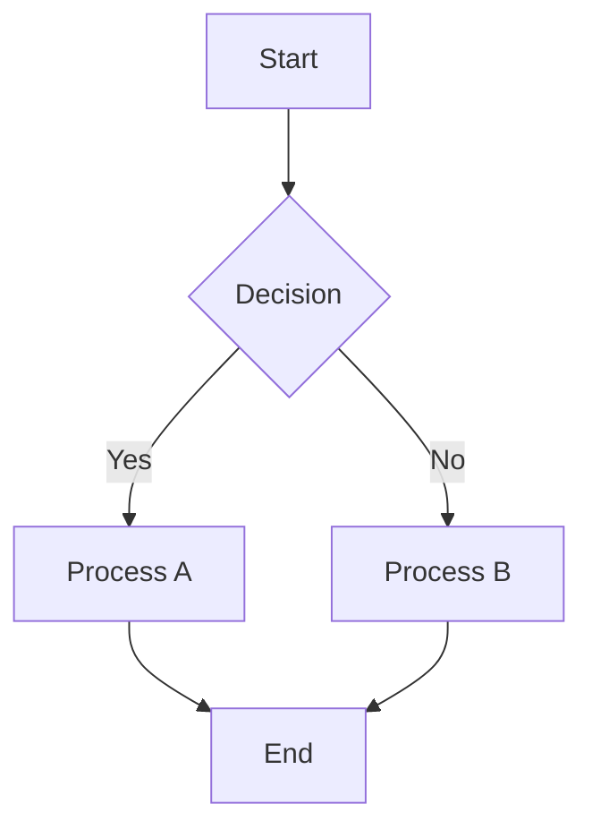

# Orchestration Storage & Naming Conventions

This document defines the standards for storing, naming, versioning, and organizing orchestration files within the system.

## Table of Contents
1. [Storage Location](#storage-location)
2. [File Extension](#file-extension)
3. [Naming Conventions](#naming-conventions)
4. [Directory Structure](#directory-structure)
5. [Versioning Strategy](#versioning-strategy)
6. [Content Standards](#content-standards)
7. [Examples](#examples)

## Storage Location

All orchestration files are stored in:
```
src/resources/orchestrations/
```

This centralized location ensures:
- Easy discovery of all orchestrations
- Clear separation from code and other resources
- Consistent access patterns for the orchestration engine
- Simple backup and version control

## File Extension

All orchestration files use the `.md` (Markdown) extension:
- **Extension**: `.md`
- **Format**: Standard Markdown with YAML frontmatter
- **Encoding**: UTF-8

This choice enables:
- Human-readable documentation
- Version control diff visibility
- IDE syntax highlighting and preview
- Easy conversion to other formats

## Naming Conventions

### File Naming Rules

Orchestration files follow these naming conventions:

1. **Format**: `{action}-{target}-{modifier}.md`
2. **Case**: All lowercase, hyphen-separated (kebab-case)
3. **Length**: Maximum 60 characters
4. **Characters**: Only letters, numbers, and hyphens

### Naming Components

- **Action** (required): The primary verb describing what the orchestration does
  - Examples: `analyze`, `monitor`, `benchmark`, `validate`, `research`, `audit`

- **Target** (required): The main subject or domain
  - Examples: `competitor`, `market`, `social-media`, `company`, `trend`

- **Modifier** (optional): Additional context or specificity
  - Examples: `comparison`, `insights`, `report`, `tracking`

### Naming Examples

✅ **Good Names**:
- `competitor-identification-profiling.md`
- `market-overview-sizing.md`
- `fact-checking-workflow.md`
- `reddit-faq-issue-analysis.md`

❌ **Avoid**:
- `COMPETITOR_ANALYSIS.md` (wrong case and separator)
- `analyze_competitors_and_market_share_trends_2024.md` (too long)
- `workflow1.md` (not descriptive)
- `social media trends.md` (contains spaces)

## Directory Structure

Orchestrations are organized into domain-based subdirectories:

```
src/resources/orchestrations/
├── business-market-intelligence/      # Market research & business analysis
├── competitive-analysis-strategy/     # Competitor & strategic analysis
├── knowledge-academic-research/       # Academic & educational research
├── meta/                             # Meta-workflows that orchestrate other workflows
├── social-media-community-insights/   # Social media & community analysis
└── technical-developer-research/      # Technical & development research
```

### Domain Descriptions

- **business-market-intelligence**: Company profiles, market sizing, industry trends
- **competitive-analysis-strategy**: Competitor analysis, SWOT, market positioning
- **knowledge-academic-research**: Literature reviews, fact-checking, educational content
- **meta**: Advanced workflows that coordinate multiple other workflows
- **social-media-community-insights**: Platform-specific analysis, sentiment, trends
- **technical-developer-research**: API discovery, framework comparison, tech trends

### Adding New Domains

New domain directories should:
1. Use kebab-case naming
2. Represent a distinct area of research/analysis
3. Contain at least 3 orchestrations to justify creation
4. Include a domain-specific README.md

## Versioning Strategy

### Version Tracking

Orchestrations use Git for version control with semantic versioning in the YAML frontmatter:

```yaml
---
version: "1.2.0"
last_updated: "2024-12-20"
compatibility: "orchestration-engine@2.x"
---
```

### Version Format

Follow semantic versioning (MAJOR.MINOR.PATCH):
- **MAJOR**: Breaking changes to inputs/outputs
- **MINOR**: New features, backward-compatible
- **PATCH**: Bug fixes, documentation updates

### Change Management

1. **Major Changes**: Create a migration guide in the orchestration
2. **Deprecation**: Mark with `deprecated: true` in frontmatter
3. **Archives**: Move old versions to `_archive/` subdirectory

### Version History

Include a changelog section in each orchestration:

```markdown
## Version History

### v1.2.0 (2024-12-20)
- Added support for TikTok analysis
- Improved error handling

### v1.1.0 (2024-11-15)
- Enhanced competitor detection algorithm
- Added market size estimation

### v1.0.0 (2024-10-01)
- Initial release
```

## Content Standards

### Required Sections

Every orchestration file must include:

```markdown
# [Orchestration Title]

[Brief description]

## Overview
[Detailed explanation of purpose and value]

## Component Workflows Used
[List of sub-workflows with descriptions]

## Process Flow
[Step-by-step process with diagrams]

## Input Requirements
[What data/parameters are needed]

## Expected Outputs
[What results users can expect]

## Usage Examples
[Real-world scenarios]

## Version History
[Changelog]
```

### Metadata Requirements

Required YAML frontmatter:

```yaml
---
id: "unique-orchestration-id"
name: "Human-Readable Orchestration Name"
version: "1.0.0"
category: "business-market-intelligence"
tags: ["competitor-analysis", "market-research"]
complexity: "medium"  # low, medium, high
estimated_duration: "2-3 hours"
last_updated: "2024-12-20"
author: "team-member-id"
status: "active"  # draft, active, deprecated
dependencies:
  - "web_search_exa"
  - "company_research_exa"
---
```

### Diagram Standards

Use Mermaid diagrams for process flows:



## Examples

### Example 1: Simple Orchestration

**File**: `src/resources/orchestrations/competitive-analysis-strategy/competitor-identification-profiling.md`

```markdown
---
id: "competitor-id-profile-v1"
name: "Competitor Identification & Profiling"
version: "1.0.0"
category: "competitive-analysis-strategy"
tags: ["competitor-analysis", "market-research", "profiling"]
complexity: "medium"
estimated_duration: "1-2 hours"
last_updated: "2024-12-20"
author: "research-team"
status: "active"
dependencies:
  - "competitor_finder_exa"
  - "company_research_exa"
---

# Competitor Identification & Profiling

Systematically identify and profile competitors...
```

### Example 2: Meta-Workflow

**File**: `src/resources/orchestrations/meta/technology-architecture-decision-engine.md`

```markdown
---
id: "tech-arch-decision-meta"
name: "Technology Architecture Decision Engine"
version: "2.1.0"
category: "meta"
tags: ["meta-workflow", "architecture", "decision-making"]
complexity: "high"
estimated_duration: "4-6 hours"
orchestrates:
  - "framework-tool-comparison"
  - "security-vulnerability-research"
  - "developer-hiring-trends"
---

# Technology Architecture Decision Engine

Meta-workflow for making high-quality technology decisions...
```

## Best Practices

1. **Clarity First**: Names should immediately convey purpose
2. **Consistency**: Follow patterns established by existing orchestrations
3. **Documentation**: Every orchestration must be self-documenting
4. **Testability**: Include example inputs and expected outputs
5. **Maintainability**: Regular reviews and updates
6. **Discoverability**: Use descriptive tags and categories

## Governance

- **Review Process**: All new orchestrations require peer review
- **Quality Standards**: Must pass linting and validation checks
- **Performance**: Document expected duration and resource usage
- **Security**: No hardcoded credentials or sensitive data
- **Licensing**: Include appropriate copyright headers

---

*Last Updated: December 20, 2024*
*Version: 1.0.0*
