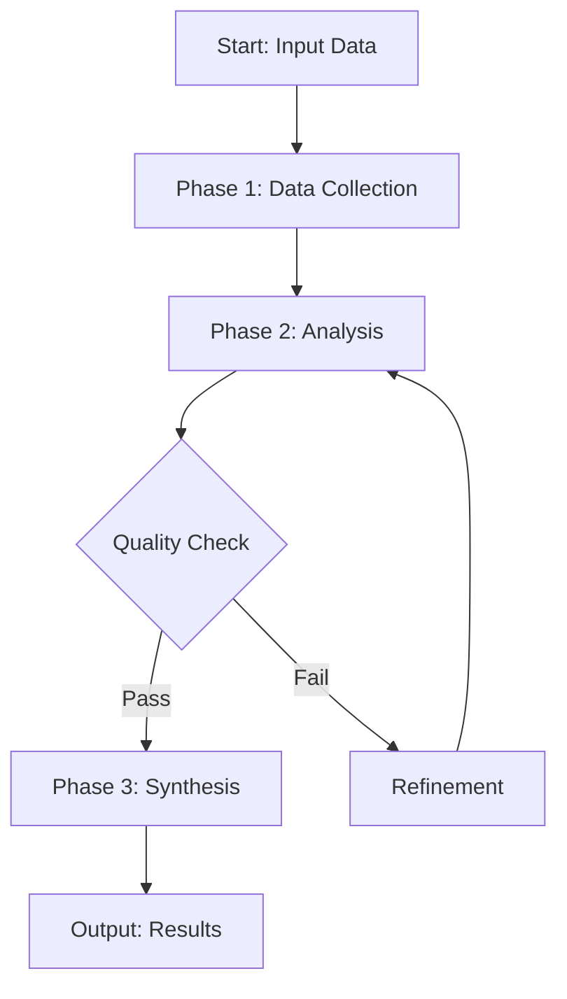

# [Orchestration Title]

[One-sentence description of what this orchestration does and its primary value proposition]

## Overview

[2-3 paragraphs providing detailed context about:]
- The problem this orchestration solves
- Who would use it and when
- Key benefits and outcomes
- Any important limitations or prerequisites

## Component Workflows Used

### Primary Components
- `workflow-1.md` - [Brief description of its role]
- `workflow-2.md` - [Brief description of its role]

### Supporting Components
- `support-workflow-1.md` - [Brief description of its role]
- `support-workflow-2.md` - [Brief description of its role]

## Process Flow

### High-Level Flow


### Detailed Process

#### Phase 1: Data Collection
**Duration**: X-Y minutes  
**Goal**: [What this phase accomplishes]

1. **Step 1**: [Description]
   - Sub-step details
   - Expected outcomes

2. **Step 2**: [Description]
   - Sub-step details
   - Expected outcomes

#### Phase 2: Analysis
**Duration**: X-Y minutes  
**Goal**: [What this phase accomplishes]

[Continue pattern for all phases...]

## Input Requirements

### Required Inputs
- **Input Name 1** (type): Description and format requirements
- **Input Name 2** (type): Description and format requirements

### Optional Inputs
- **Optional Input 1** (type): Description and when to use
- **Optional Input 2** (type): Description and when to use

### Input Validation
- [Validation rule 1]
- [Validation rule 2]

## Expected Outputs

### Primary Outputs
1. **Output Name 1**
   - Format: [JSON/Markdown/CSV/etc.]
   - Contents: [What it contains]
   - Size: [Typical size/length]

2. **Output Name 2**
   - Format: [JSON/Markdown/CSV/etc.]
   - Contents: [What it contains]
   - Size: [Typical size/length]

### Output Examples
```json
{
  "example": "output structure",
  "with": "sample data"
}
```

## Usage Examples

### Example 1: [Common Use Case]
**Scenario**: [Description of the situation]

**Input**:
```yaml
company: "Example Corp"
market: "SaaS"
depth: "comprehensive"
```

**Process**:
1. [What happens step by step]
2. [Key decision points]

**Expected Output**:
```markdown
# Analysis Results
[Sample output structure]
```

### Example 2: [Edge Case or Advanced Usage]
[Follow same pattern as Example 1]

## Error Handling

### Common Errors
1. **Error Type 1**: [Description and resolution]
2. **Error Type 2**: [Description and resolution]

### Recovery Strategies
- [Strategy 1]
- [Strategy 2]

## Performance Considerations

- **Typical Duration**: X-Y hours
- **Resource Usage**: [API calls, processing power, etc.]
- **Scaling Factors**: [What affects performance]
- **Optimization Tips**: [How to improve performance]

## Limitations

- [Limitation 1 and potential workarounds]
- [Limitation 2 and potential workarounds]
- [Known edge cases]

## Best Practices

1. **Preparation**: [What to do before running]
2. **Execution**: [Tips during execution]
3. **Post-Processing**: [What to do with results]

## Integration Notes

### API Integrations
- [Which APIs are used and how]
- [Rate limits and quotas]

### Data Flow
- [How data moves between components]
- [Data transformation points]

## Security Considerations

- [Data privacy concerns]
- [Credential management]
- [Compliance requirements]

## Version History

### v1.0.0 (2024-12-20)
- Initial release
- Core functionality implemented
- Basic error handling

---

## Development Notes

[Remove this section before finalizing]
- TODO: [Outstanding tasks]
- FIXME: [Known issues to address]
- Questions: [Open questions for review]

---

*Template Version: 1.0.0*  
*Use this template as a starting point for new orchestrations*
